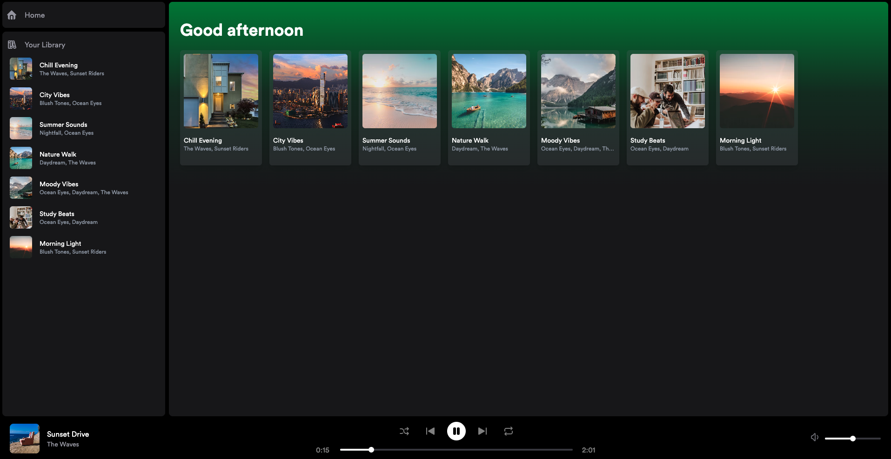
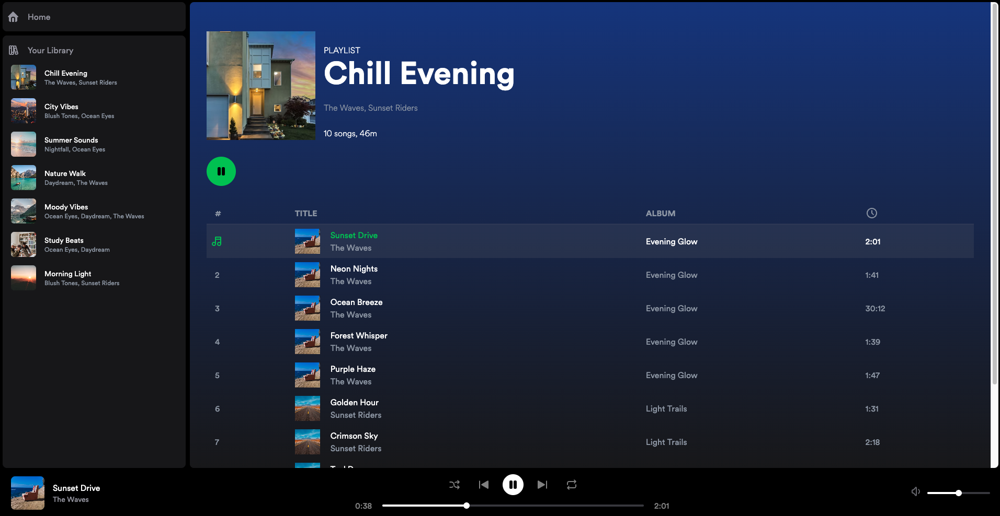

# 🎵 Spotify Clone

A Spotify-inspired music player built with modern web technologies.

## ✨ App Screenshots




## 🚀 Features

- **Real-time Music Playback**: Full audio controls including play, pause, skip, and volume
- **Modern UI**: Built with Tailwind CSS and smooth transitions
- **State Management**: Using Zustand for efficient state handling
- **Multi-framework Integration**: Combines Astro, React and Svelte components

## 🛠️ Tech Stack

- [Astro](https://astro.build/) - Web Framework
- [React](https://reactjs.org/) - UI Components
- [Svelte](https://svelte.dev/) - UI Components
- [Tailwind CSS](https://tailwindcss.com/) - Styling
- [Zustand](https://github.com/pmndrs/zustand) - State Management

## 📦 Installation

```bash
# Clone the repository
git clone https://github.com/florchial/spotify-astro-clone.git

# Navigate to project folder
cd spotify-astro-clone

# Install dependencies
npm install

# Start development server
npm run dev
```

## 🏗️ Project Structure

```text
/
├── public/
│   ├── music/           # Audio files
│   └── images/          # Images and icons
├── src/
│   ├── components/      # UI Components
│   ├── domain/         # Business logic & types
│   ├── icons/          # SVG icons
│   ├── layouts/        # Page layouts
│   ├── pages/          # Route components
│   └── store/          # State management
```

## 🎮 Usage

1. Browse available playlists in the sidebar
2. Click on a playlist to view its songs
3. Use the player controls at the bottom to:
   - Play/Pause songs
   - Skip tracks
   - Adjust volume
   - Toggle shuffle/repeat

## 🎶 Music Data

- The app includes a collection of invented songs with metadata such as title, artist, album, and duration for illustration purposes. 
- The data is stored in a TypeScript file for easy access and manipulation.
- All images and music data are for educational use only. Music: [Purple Planet Music](www.purple-planet.com)

## 🙏 Acknowledgments

- Design inspired by [Spotify](https://spotify.com)
- Music provided by [Purple Planet Music](https://www.purple-planet.com)
- Icons from [Tabler Icons](https://tabler-icons.io)
- Based on tutorial by [midudev](https://github.com/midudev)


## 📄 License

This project is for educational purposes only and is not affiliated with Spotify. Feel free to use and modify the code as you wish.